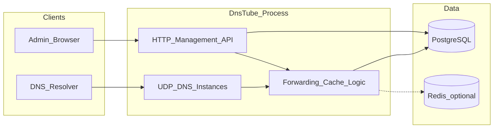

# DnsTube 1.0.0 项目初始搭建计划

## 目标与约束

- **后端**：Go，高并发 UDP DNS、多实例隔离、HTTP API 动态灌入配置与观测运行时状态。
- **前端**：**Vite+**（[VoidZero 统一工具链](https://viteplus.dev/)，脚手架与 `vp dev` / `vp build` / `vp check`）+ Vue 3 + TypeScript + Element Plus + Tailwind；单管理员、实例/记录/上游/日志/Dashboard。实现时采用**当时最新的 Vite+ 稳定版**（`vp` CLI 与文档以官方为准：[创建项目](https://viteplus.dev/guide/create)）。
- **数据**：PostgreSQL 必选；Redis 可选（先做 DB + 进程内缓存，命中瓶颈再加 Redis）。
- **部署**：原生 Docker（`docker compose` 一键起 DB + API + 静态前端或反向代理）。

当前仓库为空，本计划为 **绿色field 目录与骨架**，后续由 Agent 按里程碑填充实现。

### 已决行为（产品 / 工程）

以下已在需求侧确认，实现时写入 `AGENTS.md` 与相关 Skill，**未单独列出的细节按业内通用实现与最佳实践**（含超时、缓存防投毒等 DNS 转发常见注意点）。

1. **并行转发**：取**最快返回的有效解析结果**（竞速）；超时阈值、失败判定、防投毒等按通用实现或最佳实践选定，并在代码注释中可溯源。
2. **顺序转发**：在组内按配置顺序尝试上游，**取得第一个解析结果即停止**（不再尝试后续上游）。
3. **解析优先级**：**静态 DNS 记录优先于转发**；命中本地静态配置则不再按规则走上游（初版通配/CNAME 交互按通用语义实现）。
4. **进程与端口**：**同一进程**同时监听 **UDP DNS** 与 **HTTP 管理 API**；管理端**不强制 HTTPS**，生产环境由**上游反向代理**终止 TLS 属支持场景，文档中说明推荐反代配置。
5. **管理员初始化**：首次运行若无既有账号，生成**随机初始密码**并**写入日志**（醒目标识），登录后可在界面改密/改名。
6. **配置热更新**：**无需**监听配置文件；以 API + DB 为准。**暂停/恢复**实例以功能正确为准，**无额外时延指标**。
7. **查询日志**：表结构**尽量多字段**（时间、实例、客户端、QNAME、类型、响应码、上游耗时等可列项），**数据库永久保存**；管理员通过管理界面 **查询 + 删除**（查删表格，支持批量删除可按通用 UX 实现），不设自动过期策略（若日后要归档可再迭代）。
8. **Dashboard「转发/查询量」口径**：统计 **客户端向本 DNS 实例发起的查询请求次数**（进入解析管线的请求数，口径在 API 与图表文案中保持一致）。
9. **前端构建镜像（Vite+ CLI）**：在 **`Dockerfile.web` 中通过 `curl | bash` 安装官方 Vite+ CLI**（以 [vite.plus](https://vite.plus) 当前安装脚本为准），再执行 `vp build`；本地开发可任选全局安装或项目约定。

---

## 推荐仓库布局（面向 AI / Agent）

采用 **单仓 monorepo**，边界清晰、便于并行开发与检索：

```text
/
├── AGENTS.md             # 给 Agent/贡献者：架构地图、目录职责、常用命令、禁止事项
├── .cursor/
│   ├── rules/            # *.mdc：按 globs/alwaysApply 约束风格与分层（见下节「Rules」）
│   └── skills/           # <skill-name>/SKILL.md：领域工作流（见下节「Skills」）
├── cmd/
│   └── dnstube/          # main：解析配置、启动 API、拉起 N 个 DNS 实例
├── internal/
│   ├── dns/              # UDP 监听、查询处理、缓存、转发策略
│   ├── api/              # HTTP handlers、路由、鉴权中间件（可按资源分子目录）
│   ├── config/           # 配置加载与校验
│   ├── store/            # PostgreSQL：repository、迁移
│   └── auth/             # 单管理员 JWT 或 session
├── web/                  # Vue3 + Vite+ 工具链 + TS + Element Plus + Tailwind
├── migrations/           # SQL 迁移（或 embed 进 Go）
├── docs/                 # 可选：ARCHITECTURE.md、API 约定（与代码同步增量写）
├── docker/
│   ├── Dockerfile.api
│   └── Dockerfile.web
├── docker-compose.yml
├── Makefile / Taskfile   # 常用命令（Agent 优先从这里发现入口）
└── README.md
```

**约定**：`internal/` 不对外暴露包；对外仅 `cmd` 与必要 `pkg`（若未来抽公共库再加）。

### AI 友好型结构（如何让 Agent 少猜、快改）

目标：**可检索、可定位、边界清晰、约定写在仓库里**，而不是只靠对话记忆。

1. **顶层「地图」**：根目录 [`AGENTS.md`](AGENTS.md)（或 `CONTRIBUTING.md` 中的 Agent 小节）固定包含： monorepo 分层图、`make`/`task` 目标说明、**从需求到目录**的索引（例如「改转发逻辑 → `internal/dns`」「改管理接口 → `internal/api`」）、环境变量列表指针（指向 `.env.example`）。Agent 首次进仓先读此文件即可建立心智模型。
2. **编辑器约定**：与下节 **「Cursor Rules 与 Agent Skills」** 一并维护；Rules 管「始终遵守的短约束」，Skills 管「按任务打开的步骤与领域知识」。
3. **按领域分目录，避免万能包**：`internal/dns` 不直接写 SQL；`internal/store` 不处理 HTTP；`internal/api` 只做编排与 DTO。禁止巨型 `util`：若必须有，按 `internal/dns/forward/` 这类子包拆分，便于语义搜索（「forward」即命中转发相关代码）。
4. **API 与前端对齐**：REST 路径与 handler 文件一一对应（例如 `handlers/instance.go` 对应 `/api/v1/instances`）；后续可加 `docs/openapi.yaml` 或由 Go 生成 OpenAPI，前端用生成类型，减少「字段名猜错」。
5. **迁移与表一一可追溯**：`migrations/` 使用**有序前缀 + 简短描述**文件名（如 `0001_init.up.sql`），并在迁移内用注释标明对应领域模型；表名与 `store` 中 repository 命名一致。
6. **前端按功能纵向切片**：`web/src/views/<feature>/`、`web/src/api/<feature>.ts`、共享组件放 `components/`，路由表集中一处（如 `router/index.ts`），避免路由散落在多处导致 Agent 漏改。
7. **可执行的入口单一**：所有「怎么跑」集中在 `Makefile`/`Taskfile` 与 `package.json` scripts（对齐 `vp`），README 只写高层说明并指向 `AGENTS.md` + Make 目标，避免文档与脚本分叉。
8. **测试与源码同位**：Go 使用 `*_test.go` 紧邻实现；关键算法（转发、规则匹配）**先有测试再改**时 Agent 更安全。前端对纯函数与请求封装写轻量单测或类型约束即可。

以上与「单仓、internal 边界」不冲突；初版搭骨架时即可写入 `AGENTS.md` 骨架，并与 **rules-skills** 里程碑一起补齐 `.cursor/rules` 与 `.cursor/skills`。

### Cursor Rules 与 Agent Skills（常用约定）

**定位区分**：**Rules**（`.cursor/rules/*.mdc`）= 持久、偏静态的规范（globs 或 `alwaysApply`）；**Skills**（`.cursor/skills/<name>/SKILL.md`）= 可执行流程与 DnsTube 领域知识（何时读迁移、转发语义、与哪些文件交互）。二者互补，避免把长篇步骤塞进单条 Rule。

**Rules 建议清单（初版即可创建，后续随代码收紧 globs）**

| 文件（示例名） | 作用 | 适用方式 |
|----------------|------|----------|
| `dnstube-core.mdc` | 单仓边界、`AGENTS.md` 优先、改动范围克制、与计划/需求对齐 | `alwaysApply: true` |
| `dnstube-go.mdc` | `internal` 分层、`context` 传递、错误包装、`*_test.go` 与可测性 | `globs: **/*.go`（可收窄到 `cmd/**`、`internal/**`） |
| `dnstube-web.mdc` | Vue 3 Composition、Element Plus 与 Tailwind 分工、`web/src/api` 与 `views` 纵向切片 | `globs: web/**/*.{vue,ts}` |
| `dnstube-api.mdc` | 管理 API 前缀 `/api/v1`、JSON 命名、handler 与路由组织方式、鉴权中间件约定 | `globs: internal/api/**/*.go` |

格式遵循 Cursor：YAML frontmatter 含 `description`、`globs` 或 `alwaysApply`，正文用短列表，避免重复 `AGENTS.md` 全文。

**Skills 建议清单（项目级，路径 `.cursor/skills/<name>/`）**

| Skill 目录名 | `description` 应包含的触发场景 | 正文要点 |
|--------------|-------------------------------|----------|
| `dnstube-migrations` | 新增/修改表、SQL 迁移、`store` repository | 迁移文件命名、`up/down` 约定、与 `migrations/` 及 Go 类型同步检查步骤 |
| `dnstube-dns-forwarding` | 转发、缓存、规则匹配、转发组 | 并行=最快有效结果、顺序=首个解析结果即停、静态优先；`internal/dns` 与 `store` 边界、测试文件 |
| `dnstube-admin-api` | 管理 REST、JWT、DTO、OpenAPI（若引入） | handler 放置位置、错误码与前端对齐 |
| `dnstube-git-commit`（可选） | 写提交说明、小步提交 | 与 Conventional Commits 或团队模板一致；可与个人 git skill 分工：项目 skill 只写 DnsTube 范围前缀 |

每条 Skill 必须含合法 frontmatter：`name`（小写连字符）与 `description`（第三人称、便于检索）。可选：`reference.md` 放表结构摘要或 API 列表。

**维护约定**：重大架构变更时同步更新 `AGENTS.md` + 相关 `.mdc` 一条 + 受影响 Skill；新增领域（例如 Redis）时优先新增 Skill 而非膨胀单条 Rule。

---

## 架构要点（实现顺序依赖）



- **多实例**：每个实例 = 独立 **监听地址:端口** + 独立运行状态（可暂停 = 停止监听或短路响应）；配置与日志通过 `instance_id` 区分。
- **共享资源「转发组」**：存于 PostgreSQL，多实例通过外键/关联表引用同一组；转发规则表引用 `group_id` + 匹配模式（域名正则）。
- **转发模式（已决）**：**并行** = 多上游竞速，取**最快有效解析结果**；**顺序** = **首个解析结果即停止**。静态记录优先于转发，见「已决行为」。

---

## 数据模型（PostgreSQL）初稿

实现时用迁移文件落地，核心表建议包括：

| 领域 | 表（概念） | 说明 |
|------|------------|------|
| 管理员 | `admin_user` | 单条或固定 id=1，用户名/密码哈希、可改名改密；首启随机密码见日志 |
| 实例 | `dns_instances` | 名称、监听、启用/暂停、创建时间 |
| 静态记录 | `dns_records` | instance_id、name、type、ttl、rdata 等 |
| 转发组 | `upstream_groups`、`upstream_servers` | 组内多台服务器、健康检查字段可后续加 |
| 转发规则 | `forward_rules` | instance_id、域名正则、target_group_id、mode（sequential/parallel）、优先级 |
| 查询日志 | `query_logs` | 尽量多列：时间、instance_id、客户端 IP、QNAME、QTYPE、响应码、是否命中缓存、上游信息、耗时等；**持久存储**；管理端 **查删**；索引与分区为后续优化留口子 |

Dashboard 统计可对 `query_logs` 做 **按日/周/月/年聚合**（SQL 或物化视图按阶段选择）；指标口径为 **客户端查询请求次数**（见「已决行为」）。

---

## 后端里程碑

1. **工程骨架**：`go mod`、分层目录、`internal/config`、结构化日志、优雅关停（`context` + `signal`）。
2. **存储层**：PostgreSQL 连接池、`migrate` 工具链、migrations 首版表结构、repository 接口。
3. **DNS 核心**：基于成熟库（如 [miekg/dns](https://github.com/miekg/dns)）实现 UDP 服务、请求解析、与实例表绑定端口。
4. **缓存**：进程内 LRU/TTL（按 QNAME+QTYPE+实例），可配置大小与 TTL；Redis 留接口或第二阶段接入。
5. **转发**：解析转发组 → 按规则正则匹配 → 顺序或并行向上游发起查询 → 写回客户端与日志。
6. **管理 API**：REST + JSON；实例 CRUD/暂停；记录与转发组、转发规则 CRUD；查询日志 **分页、筛选、删除**；Dashboard 聚合接口。
7. **鉴权**：单管理员：登录发 JWT（或 secure cookie）+ 改密/改名；所有管理路由需鉴权。

API 设计建议前缀：`/api/v1/...`，与静态资源分离，便于 Nginx/Caddy 反代。

---

## 前端里程碑

1. **脚手架（Vite+）**：使用官方 **Vite+**（`vp`）按 [创建项目指南](https://viteplus.dev/guide/create) 初始化 Vue 应用（例如 `vp create vue` 或 `vp create vite -- --template vue-ts`，以当时 CLI 为准）；统一用 **`vp dev` / `vp build` / `vp check`** 作为开发与生产构建、类型检查入口；再集成 **Element Plus** 与 **Tailwind**（注意与 EP 的样式共存：Tailwind 用于布局与定制，组件用 EP）。仓库内 `package.json` 的 scripts 可对齐为调用 `vp`，便于 CI 与 Docker 一致。
2. **路由与布局**：登录页、主框架（侧栏）、Dashboard、实例、记录、上游与组、转发规则、**查询日志（查删表格）**。
3. **状态与请求**：`axios` 或 `fetch` 封装 baseURL、401 跳转登录；Pinia 存 token 与当前用户。
4. **Dashboard**：选用图表库（如 **ECharts** 或 **Apache ECharts** for Vue）展示时间序列与 TOP N 客户端；对接聚合 API（**查询量 = 客户端请求次数**）。
5. **构建**：`vp build`（或项目内等效 script）输出 `dist/`，由 Go `embed` 服务或由 `docker-compose` 中 nginx 挂载。

---

## Docker 与本地开发

- **`docker-compose.yml`**：服务 `postgres`（卷持久化）、可选 `redis`、`api`（构建自 `Dockerfile.api`）、`web` 或合并为单镜像 API+静态资源。
- **`Dockerfile.web`**：按「已决行为」在镜像内 **`curl | bash` 安装 Vite+ CLI** 后执行 `vp build`；`Dockerfile.api` 为单进程 **DNS UDP + HTTP** 的 Go 二进制（或合并镜像时一并打包）。
- **环境变量**：`DATABASE_URL`、`JWT_SECRET`、监听地址等；提供 `.env.example`。
- **开发体验**：`make dev-api` / `make dev-web` 分开展开；数据库用 compose 仅起 DB。

---

## 测试与质量（最小集）

- Go：`internal/dns` 转发与规则匹配 **单元测试**；API **handler 集成测试**（testcontainers 或 sqlite 仅当不扭曲 PostgreSQL 特性时再考虑）。
- 前端：关键表单校验与 API 类型（可逐步引入 openapi-typescript 生成类型）。

---

## 建议的实现顺序（依赖清晰）

1. 仓库骨架 + DB 迁移 + 管理员表与登录 API
2. 单 DNS 实例 UDP + 简单转发（无规则）+ 查询日志写入
3. 多实例与暂停、静态记录
4. 转发组 + 转发规则（正则 + 顺序/并行）
5. Dashboard 后端聚合 + 前端图表
6. Docker 与 README 部署说明

---

## 风险与决策点

- **日志量**：`query_logs` 字段多且永久保留，增长快；初版全量插入，若压力大再加分区/异步写入/归档策略（与「不设自动删」不冲突，归档为后续优化）。
- **正则性能**：规则按优先级排序，可考虑简单缓存「域名 → 命中规则」。
- **其余未明确项**：按业内通用实现；文档与 `AGENTS.md` 随实现补关键默认值。

本计划确认后可按上述里程碑分 PR/分 Agent 任务逐项落地。
